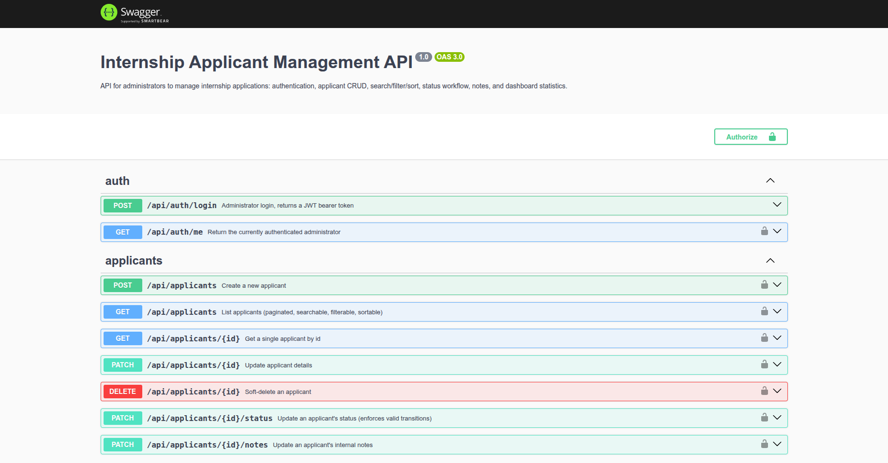
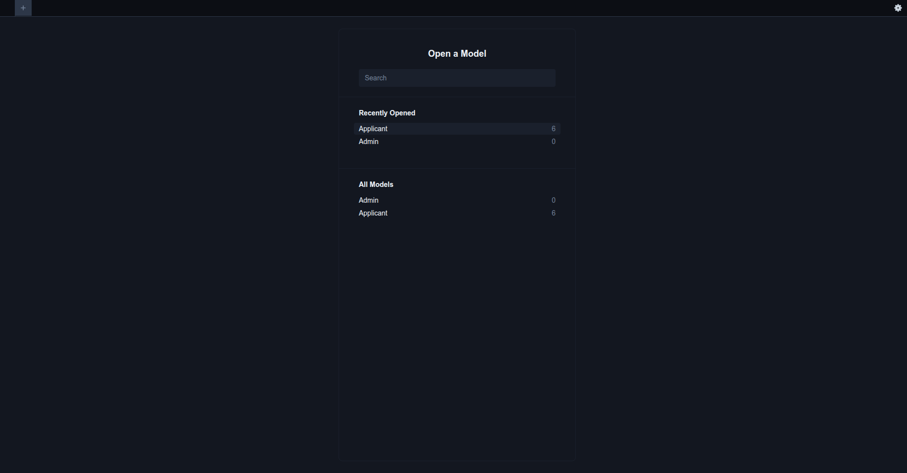
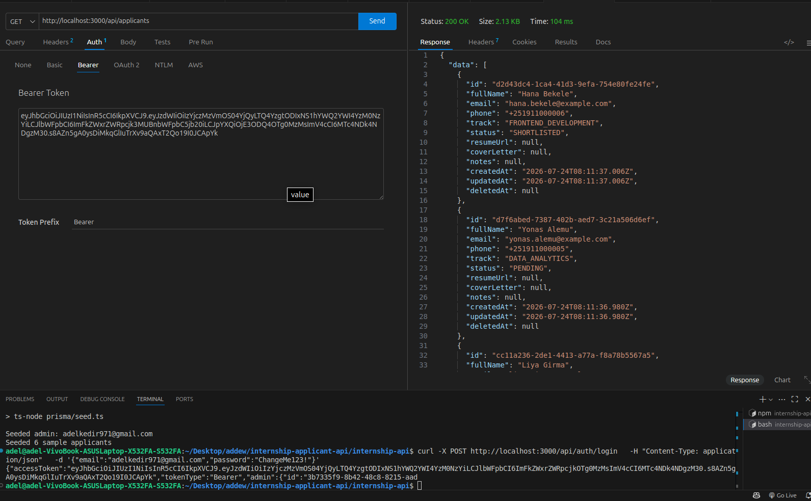

# Internship Applicant Management API

A REST API for administrators to manage internship applications: bearer-token
authenticated admin login, applicant CRUD with soft delete, search/filter/sort,
a paginated list, a status workflow with notes, and dashboard summary statistics.

Built with **NestJS + TypeScript**, **Prisma ORM** against **SQLite** (swappable
to PostgreSQL/MySQL), **JWT** bearer authentication, and **Swagger/OpenAPI** docs.

---

## Table of contents

1. [Technologies used](#technologies-used)
2. [Visual Previews ](#Visual-Previews)
3. [Project structure](#project-structure)
4. [Setup instructions](#setup-instructions)
5. [Migrations and seed data](#migrations-and-seed-data)
6. [Authentication](#authentication)
6. [API overview](#api-overview)
8. [Business rules](#business-rules)
9. [Architecture](#architecture)
10. [Testing](#testing)
11. [Docker](#docker)
12. [Assumptions and known limitations](#assumptions-and-known-limitations)

---

## Technologies used

| Concern             | Choice                                   |
|----------------------|-------------------------------------------|
| Framework            | NestJS 10 (TypeScript)                    |
| ORM / DB             | Prisma ORM, SQLite by default             |
| Auth                 | JWT bearer tokens via `@nestjs/jwt` + `passport-jwt` |
| Password hashing     | `bcrypt`                                  |
| Validation           | `class-validator` / `class-transformer`, global `ValidationPipe` |
| API docs             | `@nestjs/swagger` (OpenAPI 3)             |
| Testing              | Jest (unit) + Supertest (e2e)             |
| Config               | `@nestjs/config` (`.env` based)           |


## Visual Previews

### 1. Interactive Swagger Documentation (`/api/docs`)
Explore and test all endpoints directly through the interactive Swagger UI sandbox:


### 2. Database Management via Prisma Studio
Inspect and manage database models, entities, and relationships visually:


### 3. API Testing & Authentication
Verify requests using an authenticated Bearer token workflow:



## Project structure

```
src/
  main.ts                     Bootstrap: global pipes, filters, Swagger
  app.module.ts                Root module

  prisma/
    prisma.service.ts          PrismaClient wrapper (connect/disconnect lifecycle)
    prisma.module.ts            Global module exporting PrismaService

  auth/
    auth.module.ts
    auth.controller.ts          POST /api/auth/login, GET /api/auth/me
    auth.service.ts              Credential check, JWT issuing, password hashing
    strategies/jwt.strategy.ts   Passport JWT strategy
    guards/jwt-auth.guard.ts     Route guard
    dto/                         LoginDto, LoginResponseDto

  applicants/
    applicants.module.ts
    applicants.controller.ts     CRUD + status/notes endpoints
    applicants.service.ts        Business logic (uniqueness, status transitions, soft delete)
    applicant.enums.ts           ApplicationStatus, InternshipTrack, transition rules
    dto/                         Create/Update/Query/Status/Notes DTOs

  dashboard/
    dashboard.module.ts
    dashboard.controller.ts      GET /api/dashboard/summary
    dashboard.service.ts         Aggregation logic

  common/
    filters/all-exceptions.filter.ts   Centralized error formatting
    dto/pagination-query.dto.ts         Shared pagination DTO + meta builder
    decorators/current-admin.decorator.ts

prisma/
  schema.prisma                 Data model
  seed.ts                       Seed script (admin + sample applicants)

test/
  applicants.e2e-spec.ts        End-to-end flow test
```

Controllers only handle HTTP concerns (routing, guards, Swagger metadata) and
delegate all business logic to services, per NestJS conventions.

## Setup instructions

### Prerequisites

- Node.js 18+ and npm
- Internet access on first install (Prisma downloads its query/schema engine
  binaries the first time you run `npx prisma generate` or `migrate`)

### Steps

```bash
# 1. Install dependencies
npm install

# 2. Copy environment variables
cp .env.example .env
# Edit .env if you want a different JWT secret, seed admin credentials, etc.

# 3. Generate the Prisma client
npx prisma generate

# 4. Run migrations (creates the SQLite file and tables)
npx prisma migrate dev --name init

# 5. Seed the database with an admin account and sample applicants
npm run prisma:seed

# 6. Start the API
npm run start:dev
```

The API will be available at `http://localhost:3000`.
Swagger docs: `http://localhost:3000/api/docs`.

## Migrations and seed data

| Command                        | Purpose                                                 |
|----------------------------------|-------------------------------------------------------|
| `npx prisma migrate dev --name <name>` | Create/apply a migration in development         |
| `npx prisma migrate deploy`       | Apply pending migrations in production/CI            |
| `npm run prisma:seed`             | Seed the admin account + sample applicants           |
| `npx prisma studio`               | Browse the database in a GUI                         |

The seed script (`prisma/seed.ts`) is **idempotent** (uses `upsert` on unique
emails), so it's safe to run more than once. It creates:

- One administrator account, using `SEED_ADMIN_EMAIL` / `SEED_ADMIN_PASSWORD`
  / `SEED_ADMIN_NAME` from `.env` (defaults: `admin@example.com` /
  `ChangeMe123!` if unset).
- Six sample applicants spread across all five tracks and all four statuses.

**Switching database engines:** edit `prisma/schema.prisma`'s `datasource`
`provider` (`postgresql` or `mysql`), update `DATABASE_URL` in `.env`
accordingly, then re-run `npx prisma migrate dev`.

## Authentication

All `/api/applicants/*` and `/api/dashboard/*` routes require a bearer token.

```bash
# 1. Log in
curl -X POST http://localhost:3000/api/auth/login \
  -H "Content-Type: application/json" \
  -d '{"email":"[email protected]","password":"ChangeMe123!"}'

# Response:
# { "accessToken": "eyJ...", "tokenType": "Bearer", "admin": { ... } }

# 2. Use the token
curl http://localhost:3000/api/applicants \
  -H "Authorization: Bearer eyJ..."
```

In Swagger UI, click **Authorize** and paste the raw token (no `Bearer `
prefix needed there — Swagger adds it).

There is no self-service admin registration endpoint by design — administrator
accounts are provisioned via the seed script (or directly in the database),
since only trusted operators should be able to create admin logins.

## API overview

| Method | Endpoint                         | Auth | Description                                   |
|--------|-----------------------------------|------|------------------------------------------------|
| POST   | `/api/auth/login`                 | No   | Log in, returns a JWT                          |
| GET    | `/api/auth/me`                    | Yes  | Current admin profile                          |
| POST   | `/api/applicants`                 | Yes  | Create an applicant                            |
| GET    | `/api/applicants`                 | Yes  | Paginated list; supports `search`, `status`, `track`, `sortBy`, `sortOrder`, `page`, `limit` |
| GET    | `/api/applicants/:id`             | Yes  | Get one applicant                              |
| PATCH  | `/api/applicants/:id`             | Yes  | Update applicant details                       |
| DELETE | `/api/applicants/:id`             | Yes  | Soft-delete an applicant                       |
| PATCH  | `/api/applicants/:id/status`      | Yes  | Change status (enforces transition rules)      |
| PATCH  | `/api/applicants/:id/notes`       | Yes  | Set internal notes (max 1000 chars)            |
| GET    | `/api/dashboard/summary`          | Yes  | Totals, breakdown by status/track, last 7 days |

### Listing query parameters

```
GET /api/applicants?search=jane&status=SHORTLISTED&track=BACKEND_DEVELOPMENT&sortBy=createdAt&sortOrder=desc&page=1&limit=10
```

- `search` — case-insensitive match against full name **or** email
- `status` — one of `PENDING`, `SHORTLISTED`, `ACCEPTED`, `REJECTED`
- `track` — one of `FRONTEND_DEVELOPMENT`, `BACKEND_DEVELOPMENT`,
  `MOBILE_DEVELOPMENT`, `UI_UX_DESIGN`, `DATA_ANALYTICS`
- `sortBy` — `createdAt` (default), `fullName`, `status`, `track`
- `sortOrder` — `asc` or `desc` (default `desc`)
- `page` / `limit` — 1-based page, `limit` capped at 100

Response shape:

```json
{
  "data": [ { "id": "...", "fullName": "...", ... } ],
  "meta": {
    "total": 42,
    "page": 1,
    "limit": 10,
    "totalPages": 5,
    "hasNextPage": true,
    "hasPreviousPage": false
  }
}
```

Full request/response schemas are documented in Swagger at `/api/docs`.

## Business rules

- **Unique email** — enforced at the database level (`@unique` on
  `Applicant.email`) and checked explicitly in the service layer so a clean
  `409 Conflict` is returned instead of a raw DB error.
- **Notes ≤ 1000 characters** — enforced via `class-validator`'s `@MaxLength`
  on `UpdateNotesDto`.
- **No Rejected → Accepted** — `applicant.enums.ts` defines an explicit
  transition table (`ALLOWED_STATUS_TRANSITIONS`) consulted by
  `ApplicantsService.updateStatus()`. All other transitions (including
  re-opening a rejected or accepted applicant back to Pending/Shortlisted)
  are allowed. Invalid transitions return `400 Bad Request`.
- **Auth required for writes** — `POST`, `PATCH`, `DELETE` on applicants (and
  all dashboard/read routes) sit behind `JwtAuthGuard`.
- **Soft delete** — `DELETE /api/applicants/:id` sets `deletedAt` instead of
  removing the row. Every read path (`findAll`, `findOne`, dashboard
  aggregation) filters on `deletedAt: null`, so deleted applicants disappear
  from lists, single-record lookups, and dashboard statistics, but remain in
  the database.

## Architecture

- **Modules** — one module per bounded concern (`auth`, `applicants`,
  `dashboard`), plus a global `PrismaModule` for database access.
- **Controllers** are thin: routing, guards, and Swagger decorators only.
  All logic (uniqueness checks, transition rules, pagination math) lives in
  services.
- **DTOs** validate and document every request body/query. `ValidationPipe`
  is configured globally with `whitelist: true` and
  `forbidNonWhitelisted: true`, so unexpected fields are rejected rather than
  silently dropped or accepted.
- **Error handling** is centralized in `AllExceptionsFilter`, which
  normalizes `HttpException`s, Prisma errors (unique constraint → 409,
  not-found → 404), and unexpected errors into one consistent JSON shape.
- **Auth** uses a stateless JWT strategy (`passport-jwt`): the token carries
  the admin's id/email, and `JwtStrategy.validate()` re-checks the admin
  still exists on every request.
- **Pagination** is computed by a small shared helper
  (`buildPaginationMeta`) reused by the applicants list endpoint, keeping the
  metadata shape consistent and easy to extend to other paginated resources.

## Testing

```bash
# Unit tests (services, business rules) — no database required, Prisma is mocked
npm test

# Watch mode
npm run test:watch

# Coverage
npm run test:cov

# End-to-end tests (spins up the full app; requires a migrated database)
npx prisma migrate deploy
npm run test:e2e
```

Unit tests cover:
- `AuthService` — successful login, unknown email, wrong password
- `ApplicantsService` — duplicate email rejection, not-found handling, soft
  delete behavior, every status-transition rule (including the
  Rejected → Accepted block and the Rejected → Pending re-open case), notes
  update
- `DashboardService` — status/track breakdown defaults every enum bucket to
  zero even when there's no data for it

The e2e suite (`test/applicants.e2e-spec.ts`) exercises the full HTTP flow
end-to-end using its own isolated admin/applicant fixtures: unauthenticated
rejection, login, `/auth/me`, create, duplicate-email conflict, list with
pagination, search, the full status workflow (including the blocked
transition), notes length validation, soft delete, and the dashboard summary.

## Docker

```bash
docker compose up --build
```

This builds the image, generates the Prisma client, applies migrations,
seeds the database, and starts the API on port 3000. Data persists in a
named volume (`api-data`) mounted at `prisma/`.

## Assumptions and known limitations

- **Single admin role.** There's no distinction between admin permission
  levels — any authenticated admin can perform any action. Adding
  role-based access control would be a natural next step.
- **No admin self-registration endpoint.** Admin accounts are created via
  the seed script or directly in the database. This was a deliberate choice
  to avoid an open door for creating privileged accounts; a real deployment
  would likely add an invite-based admin-creation flow instead.
- **Resume storage is a URL field, not file upload.** `resumeUrl` assumes
  resumes are hosted externally (e.g. S3, Google Drive); there's no
  multipart file upload endpoint.
- **Status transition table is intentionally permissive elsewhere.** The
  only transition explicitly forbidden by the brief is
  Rejected → Accepted. All other transitions (including moving a Shortlisted
  or Accepted applicant back to Pending) are allowed, on the assumption that
  administrators may need to correct mistakes. Tighten
  `ALLOWED_STATUS_TRANSITIONS` in `applicant.enums.ts` if a stricter workflow
  is desired.
- **SQLite by default.** Great for local setup and grading; for production
  concurrency you'd want to switch to PostgreSQL by changing
  `datasource.provider` and `DATABASE_URL` (no code changes required beyond
  that, since query code uses Prisma's database-agnostic API — `contains`
  filters are case-insensitive on SQLite by default and can be made
  explicitly case-insensitive with `mode: 'insensitive'` on Postgres).
- **JWTs are not revocable.** There's no token blacklist/refresh-token
  rotation; logout is client-side (discard the token). Tokens expire after
  `JWT_EXPIRES_IN` (default 1 day).
- **Rate limiting / brute-force protection on login is not implemented.**
  Would be a reasonable addition (e.g. `@nestjs/throttler`) before production
  use.
